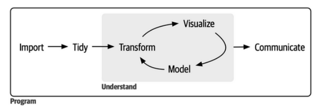

# (STAT 123) Data Science - Complete Notes - Summer 2023

[TOC]

- [Course Intro (syllabus)](#course-intro--syllabus-)
  * [Learning Objectives](#learning-objectives)
  * [Evaluation and Grading](#evaluation-and-grading)
    + [Assignments](#assignments)
    + [Lab Participation](#lab-participation)
    + [Midterms](#midterms)
    + [Final Exam](#final-exam)
- [Chapter 1](#chapter-1)
  * [What is Data Science?](#what-is-data-science-)
    + [Overview](#overview)
    + [Motivating example](#motivating-example)
    + [Definitions](#definitions)

# Course Intro (syllabus)

> Professor: Chi Kou
>
> Email: cmrkou@uvic.ca
>
> Office Hours Room: David Turpin Building A518 // BEC 160
>
> Office Hours: 
>
> - Tuesday 3:00pm - 5:00pm
> - Thursday: 3:00pm - 5:00pm
>
> Labs:
>
> - Wednesday: 2:30pm - 3:20pm

## Learning Objectives

By the end of this course, given a problem/question and some data, you will be able to write R code (a Statistical programming language) to graphically visualize and summarize the data. You will be able to interpret the graphs and summary statistics thus providing an answer to the problem/question posed. You will also be able to produce professional looking reports with all appropriate information you want to convey.

In the programming language R, you will be able to:

- Load data into R.
- Check the quality of the data.
- Prepare data for analysis purposes.
- Summarize the data.
- Visualize the data.
- Conduct basic statistical analysis, such as:
  - Estimate population parameter(s).
  - Conduct simple statistical modelling.
  - Interpret the model.
  - Evaluate the fit of the model

## Evaluation and Grading

| Assignments   | Lab Participation | Midterms          | Final Exam |
| ------------- | ----------------- | ----------------- | ---------- |
| Every 2 weeks | Weekly            | May 31, July 12th | TBA        |
| 20%           | 15%               | 30% (15% each)    | 35%        |

### Assignments

Approximately every 2 weeks you will be given an assignment based on materials covered in lectures and labs (combining theory and practice using R). You will have one week to complete the assignment and submit it for grading. While collaboration with your peers (such as discussing questions and reviewing one another’s work) is encouraged, your submitted work must be your own. Work that appears copied will be given a grade of 0. Violation of academic integrity will be dealt with according to university policy.

### Lab Participation

Each week you will be given a worksheet in lab which will help you
put concepts learned in lecture into practice using RStudio. A specialized tutorial leader will help to guide you with a demonstration and then will give you time to work on your assigned problem. You will submit your completed lab worksheet soon after the lab to be graded

### Midterms

There will be two midterm tests during the semester. The tests will be held on Wednesdays during lecture or lab time. The dates for these tests are May 31 and July 12th If you miss a test for an unavoidable reason (such as illness or family affliction), then you may be excused but you have to contact me as soon as possible. Your test score will be assigned at the same rank as your performance on the final exam (Ex: If you rank 30th on the final then you are assigned the 30th ranked mark on the test). 

If you miss both tests for an unavoidable reason then the weight will be moved to the final exam so long as the weight of the final does not exceed 60%. This will mean that
there is a 5% penalty. I will contact you to explore other options

### Final Exam

A 3-hour final exam will be held at the end of the term. The examination date is to be determined by the University and is usually released around the end of June. The examination period is August 8th - 18th, 2023. Students are strongly advised not to make plans for travel or employment during the final examination period as special arrangements will not be made for examinations that conflict with such plans

# Chapter 1 - What is Data Science



## Overview

Statistics is the science of data. In this Chapter, we learn some introductory terms related to data and we look at some examples to help illustrate these terms. We will also begin to formulate questions about finding data which we will eventually answer later on in the course.

> Note: Descriptive stats only - Summery of data

## Motivating example

More so now than ever, the world is paying attention to statistics. Daily updates on COVID-19 can include number of new infections, positive test rates, mortality rates, vaccination rates, as well as plots of an infection rate curve which we are trying to flatten. Depending on the source, the information being given can paint very different pictures. Are all of these sources equally reliable? Is the data accurate? Is the data being manipulated in a misleading way?

Whenever confronted with data, one of the first and most important questions that should be answered is: Where does the data come from?

- Reputable sources
- Government 
- non-profit organizations 

## Definitions

### Individuals / Observations

> **Individuals / Observations**
>
> Objects described by a set of data.
>
> Note: Individuals are not necessarily persons, they can be animals, etc.
>
> **Example:** 
>
> - Hospital Patients 
> - Owls
> - Tress

### Variables

> **Variables**
>
> Any Characteristic of an individual
>
> **Example**:****
>
> - Blood pressure 
> - Height
> - Size
> - Breed of dog

## Example 1 (Starbucks)

A Starbucks employee decided to collect information about several of their menu items. Consider the resulting data set:

| Menu Item    | Price | Weight(in g) | Drink? (Yes/No) |
| ------------ | ----- | ------------ | --------------- |
| Cappuccino   | $4.75 | 473          | Yes             |
| Banana Bread | $3.45 | 115          | No              |
| Dragon Drink | $5.15 | 473          | Yes             |

> Note: Tables in R are called data frames.

1. What are the individuals in this data set? Select all that apply.

- [x] Menu Item 
- [ ] Price
- [ ] Weight
- [ ] Whether it is a drink

2. What are the variables in this data set? Select all that apply.

- [ ] Menu Item 
- [x] Price
- [x] Weight
- [x] Whether it is a drink

## Definitions

### Categorical Variable (Nominal Variable) 

> **Categorical Variable (Nominal Variable)** 
>
> Variables that cannot be ranked. Places an individual into one of the several groups or categories.
>
> <u>Example:</u> "Whether it is a drink"

### Ordinal Variable

> **Ordinal Variable**
>
> A variable we can establish and rank.
>
> <u>Example:</u> "Weight" and "Price"

### Numerical Variable (Quantitative Variable)

> **Numerical Variable (quantitative variable)**
>
> Takes numerical values, it can be used to perform meaningful arithmetic operations such as averaging.
>
> <u>Example:</u> "Weight" and "Price"

How do we decide what variables to collect in our data?

- Depends on the data.

> Note: 
>
> - Categorical Variables can be numbers. (Ex. 0 or 1 for yes and no)
> - No meaningful operations cannot be done on this.

## Example 2 (Recycling Habits)

When trying to judge the recycling habits of a neighborhood, researchers went around weighing the recycling bins of each household. They found that certain streets (with more expensive houses) had heavier recycling bins and other streets (with less expensive houses) had lighter recycling bins. Does this mean that the more expensive your house the more you recycle?

<u>The individuals:</u> The Households of the neighborhood. 

 <u>The variable(s):</u> Weight of recycling bins, cost of the house, number of residence in house, type of house.

<u>Type of variable(s):</u> 

- Weight - Numerical 
- Cost - Numerical 
- Residents - Numerical 
- Types of house - Categorical

<u>Problem with the variable(s):</u> 

- Weight determine level of recycling?
- Different house types, different recycling contents

## Definitions

### Population

> **Population**
>
> The entire group of individuals about which we want information.

### Sample

> **Sample**
>
> A Sample is a subset of a population. If done correctly, we can use a sample to draw a conclusion about a population. (Inferential Stats)

## Example 3 

1. You wish to measure the mean weight of 5 month old Koala bears so you find twenty 5-month old Koala bears and weigh them.

- <u>Population:</u> All 5-month old Koala Bears
- <u>Sample:</u> Twenty 5-month old Koala Bears


2. You decide to look at all of the uncollected Stat 123 midterms from the Spring 2019 semester. Using this you make a report of the average number of mistakes a Stat 123 student in Spring 2019 made on midterms.

- <u>Population:</u> Stat 123 Students in Spring 2019
- <u>Sample:</u> Students that didn't collect their midterms.


3. You want to determine the number of wine drinkers in Victoria BC so you loiter inside the Liquor Plus store located at Quadra and MacKenzie on Monday January 11th from 3pm-5pm and count the number of people who buy wine at the store.

- <u>Population:</u> All people in Victoria
- <u>Sample:</u> shoppers at liquor stores located at Quadra and MacKenzie on Jan 11th 3pm-5pm.

> Note: Not all samples are good samples. We will discuss this idea further in later sections but if you choose a bad sample, it is not going to accurately describe the population.

## Definitions

### Observational Study

> Observational Study

### Sample Survey

> Sample Survey

### Census

> Census

### Experiment

> Experiment

 ## Example 4

- You are trying to determine the proportion of red cars on the road. You decide to count the number of cars that drive by your house and note how many of them are red.
  - **<u>Type of study:</u>**

- You want to determine if having reading break helps students do better on tests so you schedule one test before reading break and one test immediately after reading break and compare the grades on these tests.
  - **<u>Type of study:</u>**

- In a (hypothetical) study, you recruited 10 participants. First you measured their alertness (assuming we can) scores. Then you divided the participants into 2 groups of five. For the first group, you gave them a pill that contains some newly developed chemicals to improve alertness. For the second group, you gave them a pill that contains only starch. You waited 15 minutes. Now you measured their alertness again.
  - **<u>Type of study:</u>**

> **Caution**
>
> .

# Chapter 1.5 - Intro to R

## Learning Outcomes

For the first introduction to R, we are going to go over the following:

- See the difference between R and RStudio
- Writing commands in a script vs directly in the console.
- Opening an R Markdown file. 
- Check and set the directory that we are working in. 
- Adding, subtracting, multiplying, dividing and averaging values.
- Assigning values to a variable.
- Vectors.

## Difference between R and RStudio

R is a programming language used for statistical computing while RStudio uses the R language to develop statistical programs. RStudio is an example of an integrated development environment or IDE.

You can use R without RStudio but you cannot use RStudio without R (since RStudio uses R).

## The Advantage of RStudio

RStudio has a much more user-friendly interface which makes it
nice especially for beginning programmers. Additionally, RStudio allows users to develop and edit programs in R by supporting a large number of statistical packages, higher quality graphics, the ability to manage your workspace, and conveniently has a way to present your code and output as a pdf, HTML, or Github document (just a few examples).

## Writing Commands in the Console vs a Script

### Console

You can type commands directly into the console, each command will start with a > symbol, followed by the command.

Once you press enter, the command will be executed. For example, type into the console 5+2, press enter, and then type 6-3, and press enter:

```R

```


### Script

To open a script in RStudio, click on File − > New File − > R Script. The script will open above the console. In a script you type the commands each on their own line. Notice that if you press enter in the script, the command is not executed. 

For example, type into the script 5+2, press enter, and then type 6-3, and press enter:

```R

```

#### Running the script

If we want to execute the commands in the script, we need to Run the code. You can do this in a few different ways:

1. Click on the line in the script with the command that you wish to execute. Then click on − >Run.
2. Highlight the line in the script the command that you wish to execute. Then click on − >Run.
3. Click on the line in the script with the command that you wish to execute. Then (for Macs) press Command+Enter or (for PC) press Ctrl+Enter.

> **<u>Notice:</u>** When you run the code from a script, the output is shown in the console, not in the script itself.

> <u>**Question:**</u> Why not just type all of our commands into the console since typing it into a script
> involves an extra step to run the code?
>
> <u>**Answer:**</u>
>
> .

## Using R Markdown

R Markdown is a feature of RStudio which allows you to combine your script and output all in the same document. To open up a new R Markdown click on File − > New File − > R Markdown. 

In this course, when using R Markdown, we will only be creating documents. You can type in the title of your document and also select the format of your document (either HTML, PDF or Word).

> Note 1: If you wish for your document output to be in PDF format, you will need to download something called LaTeX which is a free Math programming language (I use it to write all of your notes). You can download it at: https://www.latex-project.org/get/

> Note 2: You do not need to download LaTeX if you want your document to be an HTML or Word file.

#### Advantage of R Markdown

(To be filled in)

You will be learning how to use R Markdown in your first lab.

## Checking and Setting your Directory

If is a good idea to create a file dedicated to your Stat 123 R assignments/labs. For example, I’ve created a folder called R Stat123 which is where I will save all content related to assignments and labs in this course.

You will need to tell R what file you want it to look in. For example, if you are given a data set to download and you save it to your RStat123 folder. You will need to tell R to find that data file in that folder.

## Set your Working Directory in R Studio

In order to set your directory using R Studio, click on Session − > Set Working Directory − > Choose Directory. Then select the folder that you’ve designated for R assignments.

If you want to double check that you’ve set your working directory correctly, you can type in the command: 

```R

```

If you want to set your directory manually you can use the command:

```R

```

## Adding, Subtracting, Multiplying, Dividing and Averaging in R

You already saw that we can directly perform arithmetic operations in R by using the keys:

```R

```

There are also R commands that can add or multiply many numbers:

```R

```

To find the average, we must add up all of the values and then divide by the number of values:

```R

```

> **<u>Question:</u>** Is there a better way to do this?
>
> **<u>Answer:</u>** Yes, with vectors.

In R, a vector is a list of values (which could be numerical values, TRUE/FALSE statements, characters, etc..). 

Before we can talk about vectors, we must first learn how to assign a value to a variable:

## Assigning a value to a variable

In R, we can use either < − or = to assign a value to a variable. For example:

```R

```

After assigning a value to a variable, if we want to see the value of that variable (or print the value of that variable) we just type the variable name as the command and run that line of code.

## Types of Variables

- Character - 
- Numeric - 
- Integer - 
- Logical - 

## Vectors

To create a vector in R, we use the command c( ).

For example, the vector V containing the numbers ( 6, 12, -3, 2, 51 ) can be assigned using the command:

```R

```

The vector C containing the characters ( Apple, Orange, Grape, Other ) can be assigned using the command:

```R

```

If we want to assign a sequence of numbers (each separated by 1) then we can use a colon: 

For example, the code c(4 : 9) =

```R

```

We can also write a sequence of numbers each separated by an amount k by using the command seq(a, b, k). 

For example, the code seq(4, 9.0.5) =

```R

```

Combining this together, to get a vector which contains a sequence of numbers from 6 to 20, each separated by 0.2, we would use the command:

```R

```

> **<u>Question:</u>** Why are vectors useful? 
>
> **<u>Answer:</u>** We can perform arithmetic operations using vectors which is much easier than performing those operations by individually typing in values.

### Examples

Define a vector called days which contains the days of the week (starting from Sunday) and another vector called classes which contains the numbers (0, 2, 4, 5, 4, 3, 0) which represent the number of hours of classes a student has each day of the week.

We can add up the total number of classes in a week:

```R

```

We can determine the average number of hours of classes each day of the week:

```R

```

If we want to only access some days of the week, we can specify which item of the vector classes we want to look at. For example, we can look at only the hours in the 3rd day of the week:

```R

```

We can look at only the hours from the weekdays (day 2 to day 6 of the week):

```R

```

We could assign a variable called weekdays to the vector which contains only the hours of classes during the week:

```R

```

We could then take the average number of hours of classes each weekday:

```R

```

We can assign the days vector to be the names of the classes vector elements:

```R

```

So if we want to access Thursdays class hours we have two options:

```R

```

## DataCamp Assignments

**The datacamp course:** 

Introduction to R have been assigned in datacamp as an assignment. Students in this course should have received an email from datacamp inviting them to sign up for free. Once you sign in to your account, check the due date for various assignments.

# Chapter 2 - Samples, Good and Bad

# Chapter 3 - What do Samples Tell Us?

# Chapter 4 - Sampling and Computing Statistics in R

