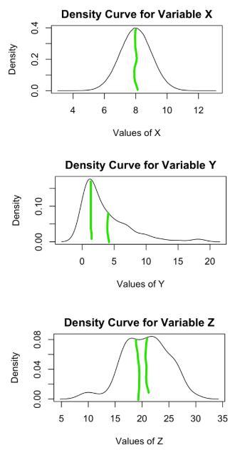

# (STAT 123) Data Science - Complete Notes - Summer 2023

[TOC]

- [Course Intro (syllabus)](#course-intro--syllabus-)
  * [Learning Objectives](#learning-objectives)
  * [Evaluation and Grading](#evaluation-and-grading)
    + [Assignments](#assignments)
    + [Lab Participation](#lab-participation)
    + [Midterms](#midterms)
    + [Final Exam](#final-exam)
- [Chapter 1 - What is Data Science](#chapter-1---what-is-data-science)
  * [Overview](#overview)
  * [Motivating example](#motivating-example)
  * [Definitions](#definitions)
    + [Individuals / Observations](#individuals---observations)
    + [Variables](#variables)
  * [Example 1 (Starbucks)](#example-1--starbucks-)
  * [Definitions](#definitions-1)
    + [Categorical Variable (Nominal Variable)](#categorical-variable--nominal-variable-)
    + [Ordinal Variable](#ordinal-variable)
    + [Numerical Variable (Quantitative Variable)](#numerical-variable--quantitative-variable-)
  * [Example 2 (Recycling Habits)](#example-2--recycling-habits-)
  * [Definitions](#definitions-2)
    + [Population](#population)
    + [Sample](#sample)
  * [Example 3](#example-3)
  * [Definitions](#definitions-3)
    + [Observational Study](#observational-study)
    + [Sample Survey](#sample-survey)
    + [Census](#census)
    + [Experiment](#experiment)
  * [Example 4](#example-4)
- [Chapter 1.5 - Intro to R](#chapter-15---intro-to-r)
  * [Learning Outcomes](#learning-outcomes)
  * [Difference between R and RStudio](#difference-between-r-and-rstudio)
  * [The Advantage of RStudio](#the-advantage-of-rstudio)
  * [Writing Commands in the Console vs a Script](#writing-commands-in-the-console-vs-a-script)
    + [Console](#console)
    + [Script](#script)
      - [Running the script](#running-the-script)
  * [Using R Markdown](#using-r-markdown)
      - [Advantage of R Markdown](#advantage-of-r-markdown)
  * [Checking and Setting your Directory](#checking-and-setting-your-directory)
  * [Set your Working Directory in R Studio](#set-your-working-directory-in-r-studio)
  * [Adding, Subtracting, Multiplying, Dividing and Averaging in R](#adding--subtracting--multiplying--dividing-and-averaging-in-r)
  * [Assigning a value to a variable](#assigning-a-value-to-a-variable)
  * [Types of Variables](#types-of-variables)
  * [Vectors](#vectors)
    + [Examples](#examples)
  * [DataCamp Assignments](#datacamp-assignments)
- [Chapter 2 - Samples, Good and Bad](#chapter-2---samples--good-and-bad)
  * [Overview](#overview-1)
  * [Motivating Example](#motivating-example)
  * [Types of samples](#types-of-samples)
  * [Practice Question](#practice-question)
- [2.5 Matrices and Data Frames in R](#25-matrices-and-data-frames-in-r)
  * [Learning Outcomes:](#learning-outcomes-)
  * [Defining a Matrix in R](#defining-a-matrix-in-r)
  * [Adding up the rows and columns of a matrix](#adding-up-the-rows-and-columns-of-a-matrix)
  * [Adding another row or another column to an existing Matrix](#adding-another-row-or-another-column-to-an-existing-matrix)
  * [Selecting an element or a row or a column from a Matrix](#selecting-an-element-or-a-row-or-a-column-from-a-matrix)
  * [Finding and locating max and min in a matrix or vector](#finding-and-locating-max-and-min-in-a-matrix-or-vector)
  * [Difference between the matrix() and as.matrix() commands](#difference-between-the-matrix---and-asmatrix---commands)
  * [Data Frame](#data-frame)
  * [Working with individual variable(s) within a data frame](#working-with-individual-variable-s--within-a-data-frame)
- [Chapter 3 - What do Samples Tell Us?](#chapter-3---what-do-samples-tell-us-)
  * [Overview](#overview-2)
  * [Motivating Example](#motivating-example-1)
- [Practice Question](#practice-question-1)
  * [Examples of desired Parameters and the Statistics used to estimate them](#examples-of-desired-parameters-and-the-statistics-used-to-estimate-them)
    + [Example 1 (Mean)](#example-1--mean-)
      - [<u>Parameter:</u> Population mean](#-u-parameter---u--population-mean)
      - [<u>Statistic:</u> Sample mean](#-u-statistic---u--sample-mean)
    + [Example 2 (Proportion)](#example-2--proportion-)
      - [Parameter: Population Proportion](#parameter--population-proportion)
      - [Statistic:](#statistic-)
  * [Sampling Bias vs Statistic Bias:](#sampling-bias-vs-statistic-bias-)
      - [Variability Analogy: Dart Board](#variability-analogy--dart-board)
- [Chapter 4 - Sampling and Computing Statistics in R](#chapter-4---sampling-and-computing-statistics-in-r)
  * [Learning Outcomes](#learning-outcomes-1)
  * [Motivation](#motivation)
  * [Producing n random numbers in R](#producing-n-random-numbers-in-r)
  * [How to select a random sample from a vector in R](#how-to-select-a-random-sample-from-a-vector-in-r)
  * [Setting a seed in R](#setting-a-seed-in-r)
  * [Accessing Data that is built into R](#accessing-data-that-is-built-into-r)
- [Chapter 5 - Data Wrangling with dplyr Package](#chapter-5---data-wrangling-with-dplyr-package)
  * [Overview](#overview-3)
  * [Install the packages](#install-the-packages)
  * [Load packages](#load-packages)
  * [Data](#data)
  * [Using the dplyr Package](#using-the-dplyr-package)
  * [Piping](#piping)
      - [Example: Consider the following code](#example--consider-the-following-code)
  * [Verbs](#verbs)
    + [rename()](#rename--)
      - [Example](#example)
      - [Problem](#problem)
    + [arrange()](#arrange--)
      - [Example](#example-1)
    + [filter()](#filter--)
      - [Example](#example-2)
      - [Practice questions](#practice-questions)
    + [mutate()](#mutate--)
      - [Changing an existing column](#changing-an-existing-column)
      - [Add new column](#add-new-column)
    + [summarize()](#summarize--)
      - [Example](#example-3)
      - [Practice Question](#practice-question-2)
    + [Using multiple verbs (combining verbs)](#using-multiple-verbs--combining-verbs-)
    + [Practice Questions](#practice-questions)
    + [group_by()](#group-by--)
      - [Example](#example-4)
  * [Extra Practice Problems from DataCamp](#extra-practice-problems-from-datacamp)
- [Chapter 6 - Visualization](#chapter-6---visualization)
  * [Overview](#overview-4)
  * [Motivating Example](#motivating-example-2)
  * [Examples](#examples-1)
- [Chapter 7 - Distribution](#chapter-7---distribution)
- [Chapter 8 - Normal Distribution](#chapter-8---normal-distribution)

# Course Intro (syllabus)

> Professor: Chi Kou
>
> Email: cmrkou@uvic.ca
>
> Office Hours Room: David Turpin Building A518 // BEC 160
>
> Office Hours: 
>
> - Tuesday 3:00pm - 5:00pm
> - Thursday: 3:00pm - 5:00pm
>
> Labs:
>
> - Wednesday: 2:30pm - 3:20pm

## Learning Objectives

By the end of this course, given a problem/question and some data, you will be able to write R code (a Statistical programming language) to graphically visualize and summarize the data. You will be able to interpret the graphs and summary statistics thus providing an answer to the problem/question posed. You will also be able to produce professional looking reports with all appropriate information you want to convey.

In the programming language R, you will be able to:

- Load data into R.
- Check the quality of the data.
- Prepare data for analysis purposes.
- Summarize the data.
- Visualize the data.
- Conduct basic statistical analysis, such as:
  - Estimate population parameter(s).
  - Conduct simple statistical modelling.
  - Interpret the model.
  - Evaluate the fit of the model

## Evaluation and Grading

| Assignments   | Lab Participation | Midterms          | Final Exam |
| ------------- | ----------------- | ----------------- | ---------- |
| Every 2 weeks | Weekly            | May 31, July 12th | TBA        |
| 20%           | 15%               | 30% (15% each)    | 35%        |

### Assignments

Approximately every 2 weeks you will be given an assignment based on materials covered in lectures and labs (combining theory and practice using R). You will have one week to complete the assignment and submit it for grading. While collaboration with your peers (such as discussing questions and reviewing one another’s work) is encouraged, your submitted work must be your own. Work that appears copied will be given a grade of 0. Violation of academic integrity will be dealt with according to university policy.

### Lab Participation

Each week you will be given a worksheet in lab which will help you
put concepts learned in lecture into practice using RStudio. A specialized tutorial leader will help to guide you with a demonstration and then will give you time to work on your assigned problem. You will submit your completed lab worksheet soon after the lab to be graded

### Midterms

There will be two midterm tests during the semester. The tests will be held on Wednesdays during lecture or lab time. The dates for these tests are May 31 and July 12th If you miss a test for an unavoidable reason (such as illness or family affliction), then you may be excused but you have to contact me as soon as possible. Your test score will be assigned at the same rank as your performance on the final exam (Ex: If you rank 30th on the final then you are assigned the 30th ranked mark on the test). 

If you miss both tests for an unavoidable reason then the weight will be moved to the final exam so long as the weight of the final does not exceed 60%. This will mean that
there is a 5% penalty. I will contact you to explore other options

### Final Exam

A 3-hour final exam will be held at the end of the term. The examination date is to be determined by the University and is usually released around the end of June. The examination period is August 8th - 18th, 2023. Students are strongly advised not to make plans for travel or employment during the final examination period as special arrangements will not be made for examinations that conflict with such plans

# Chapter 1 - What is Data Science


## Overview

Statistics is the science of data. In this Chapter, we learn some introductory terms related to data and we look at some examples to help illustrate these terms. We will also begin to formulate questions about finding data which we will eventually answer later on in the course.

> Note: Descriptive stats only - Summery of data

## Motivating example

More so now than ever, the world is paying attention to statistics. Daily updates on COVID-19 can include number of new infections, positive test rates, mortality rates, vaccination rates, as well as plots of an infection rate curve which we are trying to flatten. Depending on the source, the information being given can paint very different pictures. Are all of these sources equally reliable? Is the data accurate? Is the data being manipulated in a misleading way?

Whenever confronted with data, one of the first and most important questions that should be answered is: Where does the data come from?

- Reputable sources
- Government 
- non-profit organizations 

## Definitions

### Individuals / Observations

> **Individuals / Observations**
>
> Objects described by a set of data.
>
> Note: Individuals are not necessarily persons, they can be animals, etc.
>
> **Example:** 
>
> - Hospital Patients 
> - Owls
> - Tress

### Variables

> **Variables**
>
> Any Characteristic of an individual
>
> **Example**:****
>
> - Blood pressure 
> - Height
> - Size
> - Breed of dog

## Example 1 (Starbucks)

A Starbucks employee decided to collect information about several of their menu items. Consider the resulting data set:

| Menu Item    | Price | Weight(in g) | Drink? (Yes/No) |
| ------------ | ----- | ------------ | --------------- |
| Cappuccino   | $4.75 | 473          | Yes             |
| Banana Bread | $3.45 | 115          | No              |
| Dragon Drink | $5.15 | 473          | Yes             |

> Note: Tables in R are called data frames.

1. What are the individuals in this data set? Select all that apply.

- [x] Menu Item 
- [ ] Price
- [ ] Weight
- [ ] Whether it is a drink

2. What are the variables in this data set? Select all that apply.

- [ ] Menu Item 
- [x] Price
- [x] Weight
- [x] Whether it is a drink

## Definitions

### Categorical Variable (Nominal Variable) 

> **Categorical Variable (Nominal Variable)** 
>
> Variables that cannot be ranked. Places an individual into one of the several groups or categories.
>
> <u>Example:</u> "Whether it is a drink"

### Ordinal Variable

> **Ordinal Variable**
>
> A variable we can establish and rank.
>
> <u>Example:</u> "Weight" and "Price"

### Numerical Variable (Quantitative Variable)

> **Numerical Variable (quantitative variable)**
>
> Takes numerical values, it can be used to perform meaningful arithmetic operations such as averaging.
>
> <u>Example:</u> "Weight" and "Price"

How do we decide what variables to collect in our data?

- Depends on the data.

> Note: 
>
> - Categorical Variables can be numbers. (Ex. 0 or 1 for yes and no)
> - No meaningful operations cannot be done on this.

## Example 2 (Recycling Habits)

When trying to judge the recycling habits of a neighborhood, researchers went around weighing the recycling bins of each household. They found that certain streets (with more expensive houses) had heavier recycling bins and other streets (with less expensive houses) had lighter recycling bins. Does this mean that the more expensive your house the more you recycle?

<u>The individuals:</u> The Households of the neighborhood. 

 <u>The variable(s):</u> Weight of recycling bins, cost of the house, number of residence in house, type of house.

<u>Type of variable(s):</u> 

- Weight - Numerical 
- Cost - Numerical 
- Residents - Numerical 
- Types of house - Categorical

<u>Problem with the variable(s):</u> 

- Weight determine level of recycling?
- Different house types, different recycling contents

## Definitions

### Population

> **Population**
>
> The entire group of individuals about which we want information.

### Sample

> **Sample**
>
> A Sample is a subset of a population. If done correctly, we can use a sample to draw a conclusion about a population. (Inferential Stats)

## Example 3 

1. You wish to measure the mean weight of 5 month old Koala bears so you find twenty 5-month old Koala bears and weigh them.

- <u>Population:</u> All 5-month old Koala Bears
- <u>Sample:</u> Twenty 5-month old Koala Bears


2. You decide to look at all of the uncollected Stat 123 midterms from the Spring 2019 semester. Using this you make a report of the average number of mistakes a Stat 123 student in Spring 2019 made on midterms.

- <u>Population:</u> Stat 123 Students in Spring 2019
- <u>Sample:</u> Students that didn't collect their midterms.


3. You want to determine the number of wine drinkers in Victoria BC so you loiter inside the Liquor Plus store located at Quadra and MacKenzie on Monday January 11th from 3pm-5pm and count the number of people who buy wine at the store.

- <u>Population:</u> All people in Victoria
- <u>Sample:</u> shoppers at liquor stores located at Quadra and MacKenzie on Jan 11th 3pm-5pm.

> Note: Not all samples are good samples. We will discuss this idea further in later sections but if you choose a bad sample, it is not going to accurately describe the population.

## Definitions

### Observational Study

> **Observational Study**
>
> observes individuals and measure variable values of interest without intervention.
>
> ex. "as-is"

### Sample Survey

> **Sample Survey**
>
> Surveys only some of the individual of the population (sample) by observing values of variable (No intervention).

### Census

> **Census**
>
> Attempts to include the whole population.
>
> ex. Stats Canada

### Experiment

> **Experiment**
>
> Deliberately impose some "Treatment" on individuals in order to measure their responses (Intervention)

 ## Example 4

- You are trying to determine the proportion of red cars on the road. You decide to count the number of cars that drive by your house and note how many of them are red.
  - Type of study: **<u>Observational</u>**

- You want to determine if having reading break helps students do better on tests so you schedule one test before reading break and one test immediately after reading break and compare the grades on these tests.
  - Type of study: **<u>Experiment</u>** (Control vs treatment)

- In a (hypothetical) study, you recruited 10 participants. First you measured their alertness (assuming we can) scores. Then you divided the participants into 2 groups of five. For the first group, you gave them a pill that contains some newly developed chemicals to improve alertness. For the second group, you gave them a pill that contains only starch. You waited 15 minutes. Now you measured their alertness again.
  - Type of study: **<u>Experiment</u>** 

# Chapter 1.5 - Intro to R

## Learning Outcomes

For the first introduction to R, we are going to go over the following:

- See the difference between R and RStudio
- Writing commands in a script vs directly in the console.
- Opening an R Markdown file. 
- Check and set the directory that we are working in. 
- Adding, subtracting, multiplying, dividing and averaging values.
- Assigning values to a variable.
- Vectors.

## Difference between R and RStudio

R is a programming language used for statistical computing while RStudio uses the R language to develop statistical programs. RStudio is an example of an integrated development environment or IDE.

You can use R without RStudio but you cannot use RStudio without R (since RStudio uses R).

## The Advantage of RStudio

RStudio has a much more user-friendly interface which makes it
nice especially for beginning programmers. Additionally, RStudio allows users to develop and edit programs in R by supporting a large number of statistical packages, higher quality graphics, the ability to manage your workspace, and conveniently has a way to present your code and output as a pdf, HTML, or Github document (just a few examples).

## Writing Commands in the Console vs a Script

### Console

You can type commands directly into the console, each command will start with a > symbol, followed by the command.

Once you press enter, the command will be executed. For example, type into the console 5+2, press enter, and then type 6-3, and press enter.

### Script

To open a script in RStudio, click on File − > New File − > R Script. The script will open above the console. In a script you type the commands each on their own line. Notice that if you press enter in the script, the command is not executed. 

For example, type into the script 5+2, press enter, and then type 6-3, and press enter.

#### Running the script

If we want to execute the commands in the script, we need to Run the code. You can do this in a few different ways:

1. Click on the line in the script with the command that you wish to execute. Then click on − >Run.
2. Highlight the line in the script the command that you wish to execute. Then click on − >Run.
3. Click on the line in the script with the command that you wish to execute. Then (for Macs) press Command+Enter or (for PC) press Ctrl+Enter.

> **<u>Notice:</u>** When you run the code from a script, the output is shown in the console, not in the script itself.

> <u>**Question:**</u> Why not just type all of our commands into the console since typing it into a script
> involves an extra step to run the code?
>
> <u>**Answer:**</u>
>
> .

## Using R Markdown

R Markdown is a feature of RStudio which allows you to combine your script and output all in the same document. To open up a new R Markdown click on File − > New File − > R Markdown. 

In this course, when using R Markdown, we will only be creating documents. You can type in the title of your document and also select the format of your document (either HTML, PDF or Word).

> Note 1: If you wish for your document output to be in PDF format, you will need to download something called LaTeX which is a free Math programming language (I use it to write all of your notes). You can download it at: https://www.latex-project.org/get/

> Note 2: You do not need to download LaTeX if you want your document to be an HTML or Word file.

#### Advantage of R Markdown

(To be filled in)

You will be learning how to use R Markdown in your first lab.

## Checking and Setting your Directory

If is a good idea to create a file dedicated to your Stat 123 R assignments/labs. For example, I’ve created a folder called R Stat123 which is where I will save all content related to assignments and labs in this course.

You will need to tell R what file you want it to look in. For example, if you are given a data set to download and you save it to your RStat123 folder. You will need to tell R to find that data file in that folder.

## Set your Working Directory in R Studio

In order to set your directory using R Studio, click on Session − > Set Working Directory − > Choose Directory. Then select the folder that you’ve designated for R assignments.

If you want to double check that you’ve set your working directory correctly, you can type in the command: 

```R
getwd()
```

If you want to set your directory manually you can use the command:

```R
setwd("Your dir")
```

## Adding, Subtracting, Multiplying, Dividing and Averaging in R

You already saw that we can directly perform arithmetic operations in R by using the keys:

```R
+, -, *, /, ^
```

There are also R commands that can add or multiply many numbers:

```R
2+3+4+5
2*4
```

To find the average, we must add up all of the values and then divide by the number of values:

```R
(2+3+4) / 3
```

> **<u>Question:</u>** Is there a better way to do this?
>
> **<u>Answer:</u>** Yes, with vectors.

In R, a vector is a list of values (which could be numerical values, TRUE/FALSE statements, characters, etc..). 

Before we can talk about vectors, we must first learn how to assign a value to a variable:

## Assigning a value to a variable

In R, we can use either < − or = to assign a value to a variable. For example:

```R
x <- 3
x = 3
```

After assigning a value to a variable, if we want to see the value of that variable (or print the value of that variable) we just type the variable name as the command and run that line of code.

## Types of Variables

- Character - "Y", "N"
- String - "Yes"
- Numeric - 2, 56, -1
- Integer - -2, 0, 10
- Logical - TRUE, FALSE

## Vectors

To create a vector in R, we use the command c( ).

For example, the vector V containing the numbers ( 6, 12, -3, 2, 51 ) can be assigned using the command:

```R
V <- c(2, 3,4,5,7)
or 
V = c(2,3,4,5)
```

The vector C containing the characters ( Apple, Orange, Grape, Other ) can be assigned using the command:

```R
C <- c( Apple, Orange, Grape, Other ) 
```

If we want to assign a sequence of numbers (each separated by 1) then we can use a colon: 

For example, the code c(4 : 9) =

```R
v <- c(4:9)
```

We can also write a sequence of numbers each separated by an amount k by using the command seq(a, b, k). 

For example, the code seq(4, 9.0.5) =

```R
seq(4, 8.7, 5)
```

Combining this together, to get a vector which contains a sequence of numbers from 6 to 20, each separated by 0.2, we would use the command:

```R

```

> **<u>Question:</u>** Why are vectors useful? 
>
> **<u>Answer:</u>** We can perform arithmetic operations using vectors which is much easier than performing those operations by individually typing in values.

### Examples

Define a vector called days which contains the days of the week (starting from Sunday) and another vector called classes which contains the numbers (0, 2, 4, 5, 4, 3, 0) which represent the number of hours of classes a student has each day of the week.

We can add up the total number of classes in a week:

```R
sum(classes)
```

We can determine the average number of hours of classes each day of the week:

```R
mean(classes)
```

If we want to only access some days of the week, we can specify which item of the vector classes we want to look at. For example, we can look at only the hours in the 3rd day of the week:

```R
classes[3]
```

We can look at only the hours from the weekdays (day 2 to day 6 of the week):

```R
weekdasy[2:6]
```

We could assign a variable called weekdays to the vector which contains only the hours of classes during the week:

```R
weekdays <- classes[2:6]
```

We could then take the average number of hours of classes each weekday:

```R
mean(weekdays)
```

We can assign the days vector to be the names of the classes vector elements:

```R
names(classes) = days
```

So if we want to access Thursdays class hours we have two options:

```R
classes[5]
classes["Thursday"]
```

## DataCamp Assignments

**The datacamp course:** 

Introduction to R have been assigned in datacamp as an assignment. Students in this course should have received an email from datacamp inviting them to sign up for free. Once you sign in to your account, check the due date for various assignments.

# Chapter 2 - Samples, Good and Bad

## Overview

In this section, we begin to explore sampling as a method used to estimate features of a population. We will talk about a few different kinds of samples, some which are biased and some that seek to eliminate any bias.

## Motivating Example

Suppose we want to determine the prevalence of a certain disease (I think
we can all think of one that is of concern these days) in Canada. In order to actually determine the true value of this proportion, we would need to test every single person in the population for the disease with a test that is 100% accurate. That would be incredibly expensive and essentially impossible to execute. Instead, we could take a **sample** of Canadians and test them for the disease. How do we choose who is in the sample? What if someone selected for the sample refuses to participate in the study?

## Types of samples

We now define 4 different kinds of samples:

- **<u>Convenience sample</u>** 
  - Select whichever individuals that are the easiest to reach (ex. asking survey on the street)
  - Problem: Sample may not represent the population
- **<u>Voluntary response sample</u>**
  - Chooses itself by responding to a general appeal 
  - Same problem as above
  - Ex. voting, volunteer polling
- **<u>Simple random sample (or SRS)</u>**
  - n individuals 
  - Those n individuals are chosen in the population in such a way that they are equally likely to be selected.
  - Ex. population of 14 students in this class. Want a random sample of 3. 
- **<u>Stratified random sample</u>**
  - Stratified random sampling is a type of probability method using which a research organization can branch off the entire population into multiple non-overlapping, homogeneous groups (strata) and randomly choose final members from the various strata for research
  - Reduces cost and improves efficiency.

## Practice Question

Suppose I want to determine the proportion of current UVic students who
plan on taking Stat 353 at some point in their degree. I want to collect a sample from UVic’s population and I have a few ideas on how to take this sample.

In each scenario described below, determine what kind of sampling is being described.

> I get a list of all of the students numbers of current UVic students (as well as the corresponding email addresses) and randomly select 200 of them to contact and ask this question.

- [ ] Convenience
- [ ] Voluntary Response
- [x] SRS
- [ ] Stratified Random

> I ask everyone in Stat 123 to answer this question on their first homework assignment and use the entire class as my sample.

- [x] Convenience
- [ ] Voluntary Response
- [ ] SRS
- [ ] Stratified Random

> I post signs around UVic asking students to contact me with their answer to the question.

- [ ] Convenience
- [x] Voluntary Response
- [ ] SRS
- [ ] Stratified Random

> I randomly sample 5% of the students from each department at UVic.

- [ ] Convenience
- [ ] Voluntary Response
- [ ] SRS
- [x] Stratified Random

Certain types of sampling can produce something called bias. We say that a sample is biased if:

- It systematically favor's different outcomes. A biased sample is one that is NOT representative of convenience, voluntary (biased)

Almost always, convenience sampling and voluntary response sampling produce a biased sample. It is best to do some type of random sampling.

> <u>**Question:**</u> When should you use a Simple Random Sample vs a Stratified Random Sample? 
>
> **<u>Answer:</u>** Stratified sampling should be used when you believe that each stratum will be different from the overall population. Simple random sampling should be used if you think that all the sub groups are bout the same.

> Note: There are other types of random sampling that we did not define here which are explored further in Stat 354.

# 2.5 Matrices and Data Frames in R

## Learning Outcomes:

- Defining a matrix in R.
- Naming the rows and columns of a matrix in R.
- Commands to sum the columns and rows of a matrix.
- How to add another row or column to a matrix.
- How to select specific elements from a matrix.
- The difference between the as.matrix() and the matrix() command.
- What is the difference between a matrix and a data frame?

> **Matrix**
>
> An m×n matrix is a 2-dimensional rectangular table with m rows and n columns. Each cell in the matrix is identified by its row and column indices or names. In a matrix all the elements must be the same type of data. A matrix in R is like a mathematical matrix, containing all the same type of values (usually numbers).

## Defining a Matrix in R

In order to create a matrix in R, you use the command matrix(). The input for this function is a vector and then the number of rows or columns you want. For example:


You might want to specify how the matrix should be filled (that is, should it be filled by row or by column). There is an extra input that you can type in the matrix() function that accomplishes this:

```R
x <- matrix(c(1:6), nrow=3, byrow=TRUE)
x <- matrix(c(1:6), byrow=TRUE, nrow=3)
x <- matrix(c(1:6), nrow=3) # Warning fill in missing values using vectors (reuse)
```

Often times, the matrix is organizing data in a useful way. Perhaps the columns represent the values of certain variables and the rows represent the individuals in the sample. It is nice to associate meaning to the values in the matrix by naming the rows and the columns. For example:

Suppose we have a matrix with 4 rows and 2 columns and the rows represent the individuals A, B, C, D and the first column represents the variable Weight and the second column represents the variable Age. Suppose the pairs of data are as follows: 

(80,12), (40,3), (20,0.8), (25,1)

(a) Create a matrix M with these values.

```R
M = Matrix(c(80,12,40,3,20,0.8,25,1), byrow=TRUE, nrow=4)
```

(b) Create a vector called individuals which contains the individuals A,B,C,D and create a vector called variables which contains the two variables Weight and Age.

```R
individuals = c("A", "B", "C", "D")
variables = c("weight", "age")
```

(c) Use the R commands colnames() and rownames() to set the names of the matrix M to the appropriate vectors from part (b).

```R
colnames(M) = variables
rownames(M) = individuals
```

## Adding up the rows and columns of a matrix

There are commands rowSums() and colSums() which add up the rows and columns of a matrix.

```R
rowSums(M)
```

```
colSums(M)
```

## Adding another row or another column to an existing Matrix

Sometimes, you may wish to add more information to your matrix. Rather than re-create the matrix, we can add another row using the command rbind() and add another column using the command cbind().

For example, suppose that we wished to add another individual E with weight 30 and age 1.5 to our matrix. This amounts to adding another row. We could do this by typing in:

```R
newM = rbind(M, c(30, 105))
```

## Selecting an element or a row or a column from a Matrix

Matrices are indexed by row position and column position. Suppose we have a matrix that is called M, then:

```R
M[1,2] # row 1 column 2
```

```R
M[4,3] # Row 4 column 3
```

```R
M[ ,2] # Selct column 2
```

```R
M[3, ] # Select 3rd row
```

```R
M[1:3, ] # Select first 3 rows of M		
```

```R
M[ ,1:4] # First 4 columns or columns 1 - 4
```

## Finding and locating max and min in a matrix or vector

```R
max(M) # FInds the max
min(M) # Finds the min
```

## Difference between the matrix() and as.matrix() commands

```R
matrix() # Creates a matrix from a vector
as.matrix() # Converts a compatible object to a matrix
```

## Data Frame

**Recall**: In a **matrix** all the elements must be the **same type of data.** 

A data frame is similar to a matrix, The structure of a data frame is more flexible. The columns of a data frame are allowed to **contain different types of data**, Many data sets that we download or that are available to us in R are data frames.

In R, if you type ”mtcars” without the quotation marks, you will display the built-in dataset mtcars. If you type ?mtcars, R will display the description of the data frame.


- What are the individuals?
  - Car name 
- What are the variables?
  - those 11 variables
- Which variable(s) is (are) categorical?
  - am, vs
- Which variable(s) is (are) numerical?
  - the rest

## Working with individual variable(s) within a data frame

To display the variable hp, you can type:

```R
mtcars$hp
```

Matrix indexing also works with data frames:


## There are many ways to create a data frame

Example: Suppose we want to create a data frame below:

```R
smaple.df
```

|      | Name  | Age  | Vote  |
| ---- | ----- | ---- | ----- |
| 1    | Juan  | 22   | TRUE  |
| 2    | Maria | 15   | FALSE |
| 3    | Mark  | 19   | TRUE  |

### Example

 You may want to convert a data frame to a matrix (or vice versa). Here is an example. Consider the data frame PlantGrowth that is one of the built-in data sets in R.

```R
# Load the PlantGrowth dataset
data(PlantGrowth)
```

(a) Print out the first 2 rows of the data frame using the head() command.

```R
head(PlantGrowth, n = 2)
```

(b) Use the as.matrix command to create a matrix called weightMatrix containing only the first column of the data frame.

```R
weightMatrix <- as.matrix(PlantGrowth[, 1])
```

(c) Use the class() function to confirm that weightMatrix is in fact a matrix, and that PlantGrowth is a data frame.

```R
class(weightMatrix)
class(PlantGrowth)
```


# Chapter 3 - What do Samples Tell Us?

## Overview

In Chapter 2, we talked about various types of sampling. In this section, we will discuss the size of the sample and the variability of your results depending on the sample size and the population that the sample comes from. We will discuss the difference between a <u>parameter</u> and a <u>statistic</u>.

## Motivating Example

Suppose a chef makes a large pot of soup. He wants to check if the soup is over-salted so he takes one spoonful of the soup and tastes it. Suppose an editor wants to double check a 600-page novel for typos so they spot check 35 pages. Suppose a psychologist wants to determine the effects of an anti-anxiety drug on patients, she analyzes the results of 500 patient files. In these examples there is a sample of size 1, a sample of size 35, and a sample of size 500. How should you decide how large a sample size needs to be?

We begin with some definitions:

> <u>**Parameter**</u>
>
> some number that describes the population.

> <u>**Statistic**</u>
>
> A method or way to estimate the population parameter

# Practice Question

Suppose we are interested in the average height of all current NBA players and we currently have access to players on the Toronto Raptors.

1. <u>**The population is?**</u>

- [x] Current NBA players
- [ ] Current Raptors players
- [ ] All Basketball players

2. <u>**The sample is?**</u>

- [ ] Current NBA players
- [x] Current Raptors players
- [ ] All Basketball players

3. **<u>What is the parameter we are interested in?</u>**

- [x] The average height of all current NBA players.
- [ ] The average height of current Raptors’ players.

4. **<u>What is a statistic we can use to estimate the population parameter?</u>**

- [ ] The average height of all current NBA players.
- [x] The average height of current Raptors’ players.

5. **<u>The average height of current Raptors’ players is 6 foot 5 inches. What does this value represent? Select all that apply.</u>**

- [ ] The Population parameter
- [x] an estimate of the population parameters
- [ ] A statistic
- [x] The observed value of a statistic.

## Examples of desired Parameters and the Statistics used to estimate them

### Example 1 (Mean)

#### <u>Parameter:</u> Population mean 

$$
\mu = \frac{{\sum_{i=1}^{N} x_i}}{{N}}
$$

- *N* is the total number of observations in the population, and
- x_i represents each individual observation in the population.

#### <u>Statistic:</u> Sample mean 

$$
\bar{x} = \frac{{\sum_{i=1}^{n} x_i}}{{n}}
$$

- *n* is the total number of observations in the sample, and
- x_i represents each individual observation in the sample.

### Example 2 (Proportion)

#### Parameter: Population Proportion

p = (# of subjects in the population that has the characteristic)/ (population)

#### Statistic: Sample Porportion

p^ = (# of subjects in the sample with the characteristic) / (number of people in sample) 

> Note: 
>
> A statistic doesn’t necessarily do a good job estimating the population parameter. For example, you could use a statistic that just always equals 6. Unless you are trying to estimate a parameter that has the value 6, this is probably not a good statistic.
>
> We usually use statistics that involves computing the same quantity that is desired in the population just on the available sample instead.

### Example 3 (Variance)

#### Parameter: Population Variance

$$
\sigma^2 = \frac{1}{N}\sum_{i=1}^{N}(x_i - \mu)^2
$$


#### Statistic: Sample Variance

$$
s^2 = \frac{1}{n-1}\sum_{i=1}^{n}(x_i - \bar{x})^2
$$

> Note: 
>
> A statistic doesn’t necessarily do a good job estimating the population parameter. For example, you could use a statistic that just always equals 6. Unless you are trying to estimate a parameter that has the value 6, this is probably not a good statistic.
>
> We usually use statistics that involves computing the same quantity that is desired in the population just on the available sample instead

## Sampling Bias vs Statistic Bias:

> **<u>Bias</u>**
>
> a consistent, repeated deviation of the sample statistic from the population parameter in the same direction when we take many samples.

- Bias is in the **sample** if we do not chose from the sample "randomly"
  - Some individuals are more likely to be selected.
- Bias is in the **statistic** if you were to repeatedly take random samples and you never expect the statistic to equal the parameter value.

> Note:
>
> We will not be exploring bias in a statistic in this course but if you take other stats courses this is a very important topic.

- Another thing which can greatly impact a sample is variability.

> **<u>Variability</u>**
>
> escribes how spread out the value in the population is.


When we are sampling, we would like there to be little or no sampling bias and small variability.

#### Variability Analogy: Dart Board

You can think of the population parameter as the bullseye and the darts being thrown as the statistic estimating the parameter. Sampling bias results in the dart being consistently thrown to the same part of the board, away from the bullseye. Variability results in darts being thrown all over the board, not very close together.


> **<u>Question</u>**: 
>
> We already saw that if our sample is not random, it will be biased. Thus, to reduce bias in a study, we need to select our sample randomly. If the population we are sampling from does not have small variability, what can we do to make sure our sample accurately reflects the population?
>
> **<u>Answer</u>**:
>
> Increase the sample size. The larger the sample, the lower something called the variance of the sampling distribution is (we will define this later on). Basically, a large sample can better capture the population.

> Note:
>
> Samples don’t always need to be large. If the population does not have large variability then the sample can be small.


Consider the 3 scenarios discussed in the motivating example:

> A chef takes one spoonful of soup as a sample for the entire pot. Why is this an appropriate sample size?
>
> - n=1, as long as you stir, there is essentially no variability in the population. (The whole pot)

> An editor spot-checks 35 pages of a 600 page novel for typos. Why is this an appropriate sample size?
>
> - There is no reason to think the novel has more typos on certain pages
> - If the spot check yields many typos, we may decide that all pages need revisions.

> A psychologist analyzes 500 patient files in order to determine the effects of an anti-anxiety drug on patients. Why is her sample so large?
>
> - N = 500
> - 500 is small relative to the population
> - people are different (in general)
> - may need larger sample from more accurate estimation.

# Chapter 4 - Sampling and Computing Statistics in R

## Learning Outcomes

- Produce n random numbers in R. 
- How to select a random sample from a vector in R.
- How to set a seed in R.
- Access data that is built-in to R. 
- Read a data file into R. 
- Access a column of data.
- Compute sample statistics in R (including sample *mean*, sample *proportion* and sample *variance*)

## Motivation

- faster results
- simulation
- debug

## Producing n random numbers in R

Suppose we want to select n random integers between a and b inclusive. The following command in R will do this:

```R
sample(a:b, n)
```

- a = min
- b = max
- n = size of  sample
- a < b

So, for example the code:

```R
sample(2:75, 20)
```

Results in a vector of length 20, entries from 20 to 75.

> Note:
>
> The default for the sample() command is to perform sampling without replacement. This means that the same individual cannot be in the sample more than once. If you want to change that to allow for an individual to be in the sample more than once (referred to as sampling with replacement then you would type in:
>
> ```R
> sample(2:75, 40, replace = TRUE)
> ```

Show how to use the sample function both with and without replacement.

```{r Using sample function}
# sample without replacement

sample(2:75,20)

# or

sample(75, 20)

# this will give an error

# sample(1:20, 75)


# sample with replacement 

sample(1:20, 75, replace = TRUE)

sample(50:60,16,replace=TRUE)


```

Exercise:

```{r Exercise Question}
# Part (a)
friends = c("Rachel","Ross","Joey","Chandler","Monica", "Phoebe")

# Part (b)
who.pay.for.dinner <- sample(friends,2)

# Part (c)
who.pay.for.dinner

# Set seed to keep sample the same
set.seed(7)
new.sample = sample(friends,2)
new.sample


```

Exploring built-in data sets

```{r exploring data}
# look at the different data sets built into R
data()

# learn more about the sleep data set
?sleep

# load the sleep data set into R
data("sleep")

```

Practice with built-in data sets

```{r}
data(trees)

head(trees)

?trees

mean(trees$Girth)

```

Read in external data file

```{r read in graduates data}

# to read in the data file
# MAKE SURE the data file is in your working directory

read.csv("SecondaryGraduates.csv") # won't save as data frame

# read in data and name the data GradData
GradData = read.csv("SecondaryGraduates.csv")

# preview first 6 rows of the data set
head(GradData)

# preview first 3 rows of the data set
head(GradData,3)

# you can also preview the last 6 rows of the data set
tail(GradData)

```

Practice Question:

```{r Practice Question}
# Question 3: determine the mean
mean(GradData$Number)

class(GradData$Year)

mean(GradData$Year)

# Question 4: assign the year column to a vector
# Now we are "transforming" the data

yrs = as.character(GradData$Year)
class(yrs)

mean(yrs)

# Question 5: assign the number column to a vector
# We are extracting data from a data set
num.grads = GradData$Number
num.grads

# Question 6: name the num.grads vector using the yrs vector
names(num.grads)=yrs
num.grads

# This is useful to have the number of graduates in a named
# vector because now it is easy to access specific years using
# their name. 
num.grads["2013"]

# Question 7: Take a random sample of size 6 
set.seed(21)
samp = sample(num.grads,6)
samp

# Question 8: Take the mean of the sample (x bar statistic)
mean(samp)


```

## How to select a random sample from a vector in R

would be nice to be able to create a sample of individuals directly in R (rather than labelling our individuals with numbers and then using the sample() function to pick a sample of numbers.

You can use the sample() function on a vector. So if you put your individuals inside a vector, then you can sample the individuals from the vector directly.

### Exercise  

```R
# (a) Create a vector of names for the individuals in a dinner party

friends <- c("Alice", "Bob", "Charlie", "Dave", "Emma")

# (b) Define a variable called friends.sample which is equal to a random sample of size 2 from friends

set.seed(42)  # Setting a seed for reproducibility
friends.sample <- sample(friends, size = 2)

# (c) Print out the value of the variable friends.sample

print(friends.sample)
#[1] "Dave"   "Charlie"

# (d) Run the code again (choosing the sample and printing out the variable)

set.seed(42)  # Setting the same seed for reproducibility
friends.sample <- sample(friends, size = 2)
print(friends.sample)

# (e) Did the sample stay the same?

#Yes, the sample stayed the same because we set the seed value to 42 before generating the random sample. By setting the same seed value, we ensure that the random number generation process produces the same sequence of random numbers, resulting in the same sample being selected each time the code is run.
```

## Setting a seed in R

In R, there is a function called set.seed() which sets the starting number
used to generate a sequence of random numbers. It ensures that you get the same result if you start with that same seed each time you run the same process.

For example, if I use the sample() function immediately after setting a seed, I will always get the same sample.

So in the previous example, to get the same sample each time we run the code, we write the code as:

```R
set.seed(42)  # Setting a seed for reproducibility
friends.sample <- sample(friends, size = 2)
```

This is important for reproducibility of your results. If you are writing a paper, you want someone who runs your code to get the same results that you wrote about in your paper.

## Accessing Data that is built into R

R has many built-in data sets which are there for you to use and practice with. To see a list of the available data sets type in the command:

```R
data()
```

If you want to learn more about a certain data set. You can type a question mark followed by the name of the data set into R.

If you want to load a certain data set into R, then you type in the command data(data.set.name). For example, to load the sleep data set into R, type:

```R
data(sleep)
```

## How to access a single column of a data set

If your data set has multiple columns (this is data frame), you might wish to compute some value using only one of the columns of the data set. 

For example, consider the trees data set in R. This gives the diameter, height and volume for black cherry trees. If we want to compute the average height in our sample of cherry trees then we can access that specific column using the $ symbol:

```R
data(trees)

# Accessing the height column and computing the average
average_height <- mean(trees$height)
```

### Practice Question

Use the trees data set to answer the following questions:

1. What is the average diameter of the sample of cherry trees? (Round your answer to 2 decimal places)
   - [ ] 15.36
   - [ ]  11.83
   - [x] 13.25
   - [ ] 14.75

2. What does the value from the previous question (average diameter of the sample of cherry trees) represent?
   - [ ] A sample Statistic
   - [x] An observed value of the sample statistic.
   - [ ] A population parameter.

3. What is the sample size?
   - [x] 31
   - [ ] 40
   - [ ] 41
   - [ ] 50

## How to read an external data file into R

If you collect your own data, or download a data set from a website (for example Statistics Canada), then you need to be able to read the data into R so that you can work with the data set in the program.

For example, I downloaded a data set from Stats Canada which consists of the number of secondary education graduates in Canada between the years 2003 and 2019. I saved the data as a CSV file in my R Stat123 file. I called the file SecondaryGraduates. To read this file into R, I use the command:

```R
secondary_graduates < read.csv("path_to_file/SecondaryGraduates.csv")
```

If I want to call the data set something else in R, I can define a variable at the same time that I read in the data set:

```R
head(secondary_graduates)
```

It is often a good idea to take a quick look at the data set when you first read it into R. Some data sets are very large so you might not want to print the entire data set. To see what just the column headers and first 6 rows of the data set look like, you can use the command:

```R
head(secondary_graduates)
```

### Practice Question

The following is related to the data set SecondaryGraduates which is available for download in Brightspace.

1. Download and save the SecondaryGraduates file to your computer (in your designated R folder). Read the file into R and name it grad. Data.
    Note: Your working directory needs to be set to whatever folder you are saving this file in. Recall, to set your working directory in R click on Session − > Set Working directory − > Choose directory.
2. Using the head() function, determine the column names of the data set. 
3. Determine the mean yearly number of secondary graduates between the years 2003 and 2019.
4. Assign the Year column from the data set to a vector called yrs. Be sure to force the years to be character variables, using the command as.character().
5. Assign the Number column from the data set to a vector called num.grads.
6. Use the names() function in R to assign the elements on the num.grads vector the names coming from the years vector.
7. Set the seed to be 21. Then, take a random sample of size 6 from the num.grads vector. 8. Find the sample average annual of graduates from secondary school.

# Chapter 5 - Data Wrangling with dplyr Package

## Overview

Once we loaded a dataset onto R, we may want to ”prepare” the data before visualizing and/or analyze it. In Data Science, we called the process data wrangling. R has some built-in functions for data wrangling. The R package dplyr, is written specifically for data wrangling. It is part of the bigger packages tidyverse. When we install tidyverse, dplyr is also installed.

- We can use dplyr to sort, filter, and manipulate data in a data frame.

## Install the packages

First, you must install the packages (your R should now be up-to-date and
able to install these packages). Type the following into your R console (note: Don’t type this in an R Markdown Chunk, you only need to run this line of code 1 time).

```R
install.packages("dplyr") 
# or
install.packages("tidyverse") # if you want to dplyr and other packages
```

## Load packages

You only need to install R packages one time. However, each time you start
a new session (or a new markdown file), if you want to use any of these packages, you need to load them into your session. Type the following into your first chunk in your R markdown file:

```R
library(dplyr) 
# or
library(tidyverse) # if you want to dplyr and other packages
```

## Data

For this lesson, we will use the Real Estate data set. Download RealEstate.csv from Brightspace. Read that data set into your R session.

## Using the dplyr Package

This package is used when you have a data set that you want to subset,
organize, manipulate or create new columns from. To use different functions in this package, we use something called **piping** which we describe below.

## Piping

Piping is a method that takes something (could be a variable or the output of a function) and feeds it into something else (usually a function). The general structure for piping is:

#### Example: Consider the following code

```R
x <- 9 x %>% sqrt()
```

We can also pipe multiple times. The same structure still follows where the item on the left gets piped into the next item to its right and so on:

```R
x <- c(9, 25) x %>% sqrt() %>% sum()
```

## Verbs

The functions in the dplyr package are called verbs. You can think of these as the actions that you wish to apply to the data.

We now go over some of the verbs that are part of the dplyr package:

### rename()

We often need to refer to the column names of the data frame. We can rename the columns using the rename() verb.

#### Example

Suppose we wanted to shorten the column names in the real-estate data frame. We can do this with the following code:

```R
colnames(realEstate)

realEstate %>% rename(
    date=col_names[2],
    age = col_names[3], 
    distance = col_names[4],
    stores = col_names[5], 
    latitude = col_names[6], 
    longitude = col_names[7], 
    price = col_names[8])

colnames(realEstate)
```

#### Problem

We have renamed the columns of real-estate but we haven’t saved this newly named data frame as anything so we can’t refer back to it. To adjust this code so that we save it to a new data frame, we type:

```R
realEstate2 = realEstate %>% rename(
    date=col_names[2],
    age = col_names[3], 
    distance = col_names[4],
    stores = col_names[5], 
    latitude = col_names[6], 
    longitude = col_names[7], 
    price = col_names[8])

colnames(realEstate2)
```


### arrange()

This verb allows us to sort the values of a column in either ascending or descending order.

> **<u>Note</u>**: The default for this verb is to sort the values in ascending order (from smallest to biggest).

#### Example

```R
realEstate2 %>% arrange(price) 
realEstate2 %>% arrange(desc(price))
```

### filter()

This verb allows you to subset the data frame based on some condition. The general form for using the filter verb is as follows:

#### Example

Suppose we only wanted to consider houses that are older than 10 years. We could do this using filter:

```R
realEstate2 %>% filter(age > 10)
```

#### Practice questions

How many houses in the data frame are near 6 convenience stores?

- [x] 21
- [ ] 37
- [ ] 96
- [ ] 281

### mutate()

This verb can change a variable (column) or add a new column.

#### Changing an existing column

```R
realEstate2 %>% mutate(age = age*365)
```

#### Add new column

```R
realEstate2 %>% mutate(dist_in_100m = distance/100)
```

### summarize()

This verb allows you to compute summarizing values for variables (such as mean or median or standard deviation). The general form for the summarize verb is:

#### Example

```R
gapminder %>% summarize(mean_pop = mean(pop))
```

#### Practice Question

se the summarize command to determine the median life expectancy in the entire gapminder data frame, calling it med lifeExp.

- [x] 59.47444
- [ ] 60.7125
- [ ] 12.91711

### Using multiple verbs (combining verbs)

It is often the case that you want to use more than one verb. Since we use piping, the order in which you pipe the output of one verb into another matters.

### Practice Questions

- Determine the median life expectancy for Canada (hint: combine the verbs filter and summarize).

- [ ] 74.985
- [x] 74.90275
- [ ] 24499150

- What are the two countries in Europe with the largest population in 2002?

- [x] Germany and United Kingdom
- [ ] Turkey and United Kingdom
- [ ] Germany and Turkey


### group_by()

This verb allows you to group categorical variables together (it is often used with other verbs or to help with plotting).

#### Example

```R
gapminder %>% group_by(country) %>% summarize(mean_pop = mean(pop))
```

## Extra Practice Problems from DataCamp

The course ’Data Manipulation with dplyr’ or ‘Introduction to the Tidyverse’ in DataCamp has very good short video explanations on how to use this package. They also use the gapminder dataset.

# Chapter 6 - Visualizing Data using R and ggplot2 package

## Overview

 So far, we’ve discussed different ways of collecting data (methods of sampling) and we’ve seen how to read an external data set into R and how to access particular values from a data set whether it is a matrix or a data frame. We also learned some basic data wrangling techniques. We will now begin exploring how to visualize the data once it is read into R.

Visualization of data is a very important presentation method. It is a quick way to represent the data and to illustrate what the data is telling you. That being said, caution must be taken when choosing how to display the data visually as not all types of plots are appropriate for all types of data.

## Motivating Example

 Suppose you have several data sets that you want to visualize. These
include the final letter grade distribution for a previous Stat 123 class, the annual lynx trappings in Canada, and the number of gears in a variety of manual and automatic cars. What is the best way to display these data sets?

In this chapter, we will cover several types of plots: bar charts, histograms, scatter plots, and line plots. We will not use R’s built-in graphics. Instead, we will use the gglot2 package.

## Examples

```R
#realEstate = read.csv("RealEstate.csv", header = TRUE)

library(tidyverse) #this will load ggplot2, dplyr, and other packages

# or 

library(ggplot2)   #just this if you only want to present graphics


ggplot()          # show an empty canvas


# Download grades.csv and rawgrades.csv from Brightspace


Grades.distn <- read.csv("grades.csv")

Grades.distn

#load tidyverse before using read_csv()

#Grades.distn <- read_csv("grades.csv")

# Vertical bar graph
ggplot(Grades.distn, aes(x = Grade, y = Count)) + geom_bar(stat = "identity")


# horizontal bar graph
ggplot(Grades.distn, aes(x = Count, y = Grade)) + geom_bar(stat = "identity")


# set colour of the bars
ggplot(Grades.distn, aes(x = Count, y = Grade)) + geom_bar(stat = "identity", fill = "red")


# set colour of the bars using colour code and add title and labellings:

ggplot(Grades.distn, aes(x = Grade, y = Count)) + geom_bar(stat = "identity", fill = "#FF6666") +
  ggtitle("Grade Distribution") + labs(y = "Frequency")


# set different colours for different bars

ggplot(Grades.distn, aes(x = Count, y = Grade, fill = Grade)) + geom_bar(stat = "identity") +
  ggtitle("Grade Distribution") + labs(x = "Frequency")

# different orientation

ggplot(Grades.distn, aes(x = Grade, y = Count, fill = Grade)) + geom_bar(stat = "identity") +
  ggtitle("Grade Distribution") + labs(x = "Frequency")

# data comes in without frequency counts yet

rawgrade <- read_csv("rawgrades.csv")

head(rawgrade)

# To produce frequency table

rawgrade %>% group_by(Grade) %>% count

# Same as above, Add the column name "Frequency"

rawgrade %>% group_by(Grade) %>% count(name = "Frequency")


# Produce bar graph

ggplot(rawgrade, aes(y = Grade)) + geom_bar()


ggplot(rawgrade, aes(x = Grade, y= after_stat(count/sum(count)), fill = Grade)) + geom_bar() +
  ggtitle("Grade Distribution") + labs(y = " Relative Frequency")


ggplot(rawgrade, aes(x = Grade, y= after_stat(100*count/sum(count)), fill = Grade)) + geom_bar() +
  ggtitle("Grade Distribution") + labs(y = " Relative Frequency (%)")

# histogram demo

?morley

# basic histogram

ggplot(morley, aes(x = Speed)) + geom_histogram()


mean(morley$Speed)

# add a vertical line to indicate the average speed from the data

# try it for median instead

ggplot(morley, aes(x = Speed)) + geom_histogram() + 
  geom_vline(xintercept = mean(morley$Speed), linetype = "dashed", size = 1.0)


# set histogram borders to red and the bars to green

ggplot(morley, aes(x = Speed)) + geom_histogram(color = "red", fill = "green") + 
  geom_vline(xintercept = mean(morley$Speed), linetype = "dashed", size = 1.0)


# change the width (interval length) of the bins

ggplot(morley, aes(x = Speed)) + geom_histogram(binwidth = 50, 
  color = "red", fill = "green") + 
  geom_vline(xintercept = mean(morley$Speed), linetype = "dashed", size = 1.0)


# limit the histogram to include values between 700 and 1000 only

ggplot(morley, aes(x = Speed)) + geom_histogram(aes(y = after_stat(count / sum(count))), 
  color = "red", fill = "green") + 
  geom_vline(xintercept = mean(morley$Speed), linetype = "dashed", size = 1.0) +
  xlim(700, 1000) 

# lineplots:

class(lynx)

Year <- 1821:1934
lynx.df <- as.data.frame(cbind(Year, lynx))
head(lynx.df)

ggplot(lynx.df, aes(x = Year, y = lynx)) + geom_line()
```

## Histograms

### Motivating Example

Let’s look the penguin data set in the palmerpeguins package. A histogram is an effective visualization tool when **<u>you have a numerical variable that takes on many different values.</u>**

A histogram groups values together and then displays how many individuals in the sample belong to each group of values. 

For example, the distribution of the following variables could be displayed using a histogram:

- weight (mass) of penguins
- speed of vehicles crossing an intersection when traffic light turns yellow 
- SAT scores

Suppose you were trying to determine the distribution of SAT scores. If you have a sample of 20 people with the following scores:


### How to make a Histogram using ggplot()

To produce a histogram, the word geom histogram can be used in ggplot().

Let’s use the morley data set with the basic command:

```R
morley_hist <- ggplot(morley, aes(x = Speed)) + geom_histogram()
```

### Notes

Sometimes you may want to indicate where the mean or median is in your data. You can do this by adding:

```R
geom_vline(xintercept = , linetype = "dashed", size = 1.0) 

ggplot(morley, aes(x = Speed)) + geom_histogram() + geom_vline(xintercept = mean(morley$Speed), linetype = "dashed", size = 1)
```

You can specify border and fill colours:

```R
ggplot(morley, aes(x = Speed)) + geom_histogram(color = "red", fill = "green") + geom_vline(xintercept = mean(morley$Speed), linetype = "dashed", size = 1.0)
```

You can add titles and labels exactly the same way as the bar graphs.

You can adjust interval length of each bar (bin width) by specifying binwidth in aes():

```R
aes(binwidth = ... )
```

Set the bin width to help tell your story.

You can convert frequencies to relative frequencies by using the following in aes():

```R
aes(y = count/sum(count)) 
#or 
aes(y = 100*count/sum(count)) # if you want percentages
```

You can specify your x-axis range by adding xlim( , ) parameter

```R
+ xlim(lower, upper)
```

By limiting the range, some information is lost.

### What can we tell from a Histogram?

> **<u>Distribution</u>**
>
> The term distribution is used commonly in statistics. A distribution of a variable is how data is spread over the range of values

Thus, when we plot data. We are visualizing the distribution of the variable we are plotting.

> **<u>Outlier</u>**
>
> An observation that falls outside the overall pattern of the graph. This is a value in the dataset that lies far away from the rest of the data.
>
> 

> **<u>Symmetric</u>**
>
> The left and the right of the histogram are approximately mirror images of each other.
>
> 

#### Skewed to the left

- Left side of the histogram extends further out rather than the right side


#### Skewed to the right

- Right side of histogram has long tail


> **<u>Variability</u>**
>
> The spread of the values.
>
> 

## Line Graphs 

> **<u>Line Graph</u>**
>
> Numerical variable, ollected over time. 
>
> When x variable is time, we all this series.

### Line Graphs with ggplot

me series data is very easy to plot in R. The word is use is geom line.You
will need to specify which variable goes to the x-axis and which goes to the y-axis. For example, the following code creates a line graph for the lynx time series:

```R
Year <- 1821:1934 lynx.df <- as.data.frame(cbind(Year, lynx)) head(lynx.df)
ggplot(lynx.df, aes(x = Year, y = lynx)) + geom_line()
```

> **<u>Question:</u>** What can we notice from plotting a line graph?
>
> **<u>Answer:</u>** We can notice something called a **trend** and **seasonal variation**

> **<u>Trend</u>**
>
> In a time series is a long term trend, goes up or down.

> **<u>Seasonal Variation</u>**
>
> A pattern repeating itself over a period of time

# Chapter 7 - Distribution

## Overview

n Chapter 6, we saw methods of visualizing the distribution of numerical variables with histograms. We also briefly discussed characteristics of a distribution such as variability, symmetry and skewdness. With a concept such as variability, we have not seen how to precisely capture this with a numerical value. In this chapter, we will learn not only how to compute variability, but several numerical values that help us describe a distribution.

## Motivating Example

Consider the airquality data set that is built into R. This data set consists
of daily readings of air quality values from May 1, 1973 to September 30, 1973 in New York. The variables in this data set are Mean Ozone (in parts per billion), Solar radiation, Average Wind speed, and Maximum daily Temperature (measured in degrees Fahrenheit). All variables are numerical and their distributions can be visualized by creating histograms. How else can we quantify their distributions?

We begin with some definitions:

## Definitions of median and Quartiles

> **<u>Median</u>**
>
> The midpoint of a distribution. it is the number such that half (50%) of the observations are smaller and half are larger.
>
> It is one way to measure the center of a distribution. (Mean is another)

## How to calculate the median 

1. Arrange all observations from smallest to largest.
2. Select the middle observation. If there is no middle (because the number of observations is even) then take the average of the two middle values. This is the median.

### Example

Consider a random sample of 10 observations of the Temperature variable from the airquality data set:


Determine the median of this sample:


> Note:
>
> What we just computed was a **sample median** (thus it was an observed value of a statistic ˜x). If we had the median of the entire population then that would be the value of the **population parameter** M.


## How to compute median and quartiles in R

### Practice Question

## How to make a Boxplot:

### Example

## Standard Deviation

### Definition

### Notiation

### How to Compute s (by hand)

### Example

### Computing Sample standard deviation in R

### Interpreting Standard Deviation

## When to use Median vs When to use Mean

# Chapter 8 - Normal Distribution

## Overview

In Chapter 7, we explored ways of describing the center and the spread of distributions. We saw that, for symmetric distributions, using the mean and the standard deviation is a way to achieve this and for non-symmetric distributions, it is more appropriate to use the median and quartiles. In this chapter, we discuss a way of smoothing the appearance of our distribution and then we focus on a very special type of distribution called the Normal Distribution.

## Motivating Example

Suppose we take a sample of 100 individuals from a population and observe
some numerical variable for each individual in the sample. If we then create a histogram to help visualize the distribution of the variable, the histogram will appear as several rectangles. What if we wanted to represent the distribution with a smooth curve instead of rectangles?

> **<u>Density Curve</u>**
>
> For a given variable X measured on some population, a density curve for X is

## Sketch of a density curve

Suppose we had the following histogram, a density curve would look like a smooth curve that follows a similar pattern as the histogram:


## How to plot a density curve using ggplot2

It should not be a surprise that we can use the word geom density() in ggplot2. 

> **<u>Note:</u>**  that a density curve has a total area of 1 underneath it.

### Example

Consider the CO2 dataset built into R and the variable of the carbon dioxide uptake rates from a variety of grass species.

- The following ggplot command will produce a histogram and a density curve in the same plot.

```R
ggplot(CO2, aes(x = uptake)) + geom_histogram(aes(x=uptake ,y= after_stat(density)), binwidth = ) + geom_density(aes(x=uptake,y=after_stat(density)), col = "red")
```

- Just like other graphs in ggplot2, you can add colour and title to the density curve.

```R
ggplot(CO2, aes(x = uptake)) + geom_histogram(aes(x=uptake ,y= after_stat(density)), binwidth = 3) + geom_density(aes(x=uptake,y=after_stat(density)), col = "red") + ggtitle("Distribution of Carbon Dioxide Uptake") + labs(x = expression(paste("carbon dioxide uptake rates (", mu, "mol/", m^2, " sec)")))
```

> **<u>Question:</u> ** 
>
> How can we represent the median and mean on density curves?
>
> **<u>Answer:</u>** 
>
> We know that median represents the value at which 50% of the observations lie below.
> With a density curve, this means that 50% of the area below the curve will lie to the left of the median and 50% of the area will lie to the right of the median.
>
> For the mean, we think of the point on the density curve at which the curve would balance if it was made of solid material. This can be difficult to eyeball (which is why we normally just compute the mean using software).
>
> Consider the estimated density curves for some variables X, Y and Z:
>
> 

> Note: 
>
> Curve for X: Symmetric Distribution (Mean = Median)
>
> Curve for Y: Right-skewed Distribution (Mean > Median)

## Summery

When a density curve is symmetric, the mean and the median are both at the same point; the center of the curve. When the curve is not symmetric, the mean gets pulled away from the median, in the direction of the tail of the distribution.

We now introduce one of the most famous distributions in statistics; the **<u>Normal Distribution</u>** (Gaussian Distributed).

 A variable X is called **normally distributed** if the density curve is described by a complicated formula (you do not need to know this formula). This distribution is symmetric about its mean and shaped like a bell (that is, has a peak in the center and has tails which fall off quickly).

The following code will produce a normal density curve:

```R
x <- c(1:50, by=0.05) 
y <- dnorm(x, mean = 20, sd = 5) 
normaldata <- as.data.frame(cbind(x, y))

ggplot(normaldata, aes(x = x, y = y)) + geom_line()
```

## Properties of the Normal Density Curve

- The Normal curve is completely described by

> Its mean and its standard deviation

- The mean determines

> The center of the distribution

- The standard deviation determines

> The width of the curve 


> **<u>*WARNING:*</u>** 
>
> All normal density curves are symmetric and bell-shaped. Not all symmetric and bell-shaped curves are normal.

## The 68-95-99.7 Rule

With any Normally distributed variable X, approximately:

- 68% of observations fall within 1 Standard deviations from the mean.
- 95% of observations fall within 2 Standard deviations from the mean.
- 99.7% of observations fall within 3 Standard deviations from the mean.


### Example

Suppose you have a variable X which is normally distributed with mean 12 and standard deviation 3. Determine the range of values that 95% of the observations should fall within.
$$
(\mu -20\%, \mu + 20\%)
$$
(12 -2(3), 12+2(3)) = (6,18)

### Practice Question

Approximately what percentage of observations of X should fall between
(3, 21)?

- [ ] 68%

- [ ] 95%

- [x] 99.7%

  

> **<u>Question:</u>**
>
> What if we want to determine the range of values for different percentages?
>
> **<u>Answer:</u>**
>
> In any second year stat course you will learn how to do this by hand (using something called the standard normal distribution). In this course, I will show you two different methods to approximate these values in R.
>
> Recall from Chapter 7, the command:
>
> ```R
> quantile(X,0.25)
> ```

## Approximating the Quantiles of a Normally Distributed Variable

We will illustrate both methods of approximating quantiles using an example.


### Example

Download and save the variable.X.Sample.csv dataset from Brightspace. Then, read the data into R.

<u>**Step1:**</u> Determine if the variable is approximately normal.


We notice:


**<u>Step 2 (Method 1):</u>** Use the quantile() function to determine the quantiles (often referred to as percentiles) from the sample. This will approximate the true quantiles/percentiles in the population. 

Suppose, for example, we wanted to approximate the range of values such that 80% of the observations of X fall between these values:

Sketch:

## Determining the quantile/percentile of an observation

What if we want to go in the other direction? That is, what if we want to know what percentage of observations fall below a given observation?

We use the function pnorm() (where the p stands for percentile and norm still stands for normal). Again, this function takes in 3 arguments: the observation value that you wish to find the percentile for, and the mean and standard deviation of the variable.

### Example

Using again the sample mean and sample standard deviation for X

(a) Determine the percentile of the observation 41.49.

Percentage of x-value that are below 41.49

```R
pnorm(41.49, x_bar, s)
```

(b) Determine the percentile of the observation 36.41.

```R
pnorm(36.41, x_bar, s)
```

> **<u>Note:</u>**
>
> this can also be a vector of values

> **<u>Question:</u>**
>
> What types of variables are normally distributed?
>
> **<u>Answer:</u>**
>
> height, weight, students grades, etc.

- Some real life variables are roughly normal distributed (symmetric and bell-shaped). Examples of types of variables that are often normally distributed are:
  - height, weight, students grades, etc.
- Certain statistics are approximately normally distributed. Examples of such statistics are:
  - (From theory)
  - Sample Mean.
  - Sample Proportion.
  - They are approximately normally distributed when the sample is large.

> **<u>Question:</u>** 
>
> What does it mean for a statistic to be approximately normally distributed? 
>
> **<u>Answer:</u>**
>
> If we were to take many samples of size n, and compute the sample mean of  those samples. Then we produce a histogram and density curve. It will then look very normal.

## Demo in R Showing the Distribution of different statistics

We will now look at a demonstration in R which shows that the distribution of the sample mean is approximately normal (when the sample is large) and that the distribution of the sample standard deviation is not normal.

he code for this demo will be posted in Brightspace.

> **<u>Question:</u>** 
>
> Since, for large samples, we know that the sample mean and sample proportion are normally distributed, what are the means and standard deviations for their distributions? 
>
> **<u>Answer:</u>** 
>
> The mean and standard deviation of the sample mean X̄ are:
>
> - Mean (μ<sub>X̄</sub>): μ (same as the population mean)
> - Standard Deviation (σ<sub>X̄</sub>): σ / √n (where σ is the population standard deviation and n is the sample size)
>
> The mean and standard deviation of the sample proportion ˆp are:
>
> - Mean (μ<sub>ˆp</sub>): p (same as the population proportion)
> - Standard Deviation (σ<sub>ˆp</sub>): √((p(1-p))/n) (where p is the population proportion and n is the sample size)

> **<u>Standard error:</u>**
>
> The standard deviation for the statistic 
>
> 

We often need to estimate the standard error of a statistic. The estimated standard error for the sample mean and the sample proportion are:
$$
(sample proportion): \sqrt{\frac{p(1-p)}{n}}
$$

$$
(sample mean): \frac{\sigma}{\sqrt{n}}
$$


## Practice Question

Use R, to determine the estimated standard error of the sample mean for
the X variable sample from the variable.X.Sample.csv dataset that you downloaded earlier in the notes. Round your answer to 3 decimal places.

```R
s = sd(x)
n = length(x)
ese = s/sqrt(n)
```

- [ ] 0.228
- [ ] 2.727 
- [ ] 36.759
- [ ] 143

> **<u>Question:</u>** 
>
> Why is this useful? 
>
> **<u>Answer:</u>** 
>
> We can use all these to compute something called **<u>*confidence interval.*</u>**

A confidence interval is an interval we use to find an estimate for some population parameter.

ex. pop. mean, pop proportion, pop standard deviation, etc.

## Motivating Example

Suppose a lightbulb manufacturer wants to determine the average lifespan
of their bulbs. They take a random sample of 80 lightbulbs from their production line and then record the number of hours the lightbulbs stay on before burning out (this test takes a number of days). The resulting data produces a *sample mean lifetime of 103.4 hours*. How accurate is this estimate? Is the value of the sample mean close to the value of the population mean? How confident can we be that the true average lifetime of their lightbulbs lie within ±3 hours of this time?

These are some of the questions we seek to discuss further in this part of the chapter.

> **<u>Estimate (Population Parameter)</u>**
>
> is another term for the observed value of the statistic.
>
> - ex. x_bar = x_1 + x_2 ...+ x_80 / 80  = is a statistic
> - x_bar is also an estimator for population mean.
> - The estimate is the actual value which is 103.4 in example

> **<u>Margin of error</u>**
>
> - A value computed using both the size of the sample and (if known, the variability in the population)
>
> - It represents the amount (below and above) the estimate that the true parameter belong within with percentage of confidence.
>
> - in this example, margin of error is 3 hours.
>
>   - 103.4 +- 3 hours
>
>     ```R
>     moe()
>     ```
>
>     

> **<u>Confidence interval</u>**
>
> is a range of values (estimate is in the middle of the range)which we are y% confident that contains the true value of the parameter. 
>
> - (estimate) +/- (margin of error)

# Chapter 10 - Bootstrapping a sampling distribution

## Overview

 In Chapter 8, we defined a sampling distribution for a statistic as the distribution that comes from sampling the population repeatedly, computing a statistic on each sample, and then plotting all of the observed values of the statistic. We focussed on two statistics that have known distributions; the sample mean (¯x) and the sample proportion (ˆp) which are both approximately normal for large sample sizes.

Knowing the distribution for the sample mean and the sample proportion allowed us to compute confidence intervals for the population parameters that these statistics are estimating. Specifically, it allowed us to compute the critical value (which is part of the margin of error). 

In this lecture, we are going to see how to handle statistics that we do not know the distribution for by combining our knowledge of sampling distributions with writing loops in R. We will learn how to approximate the sampling distribution for a statistic and use that to compute confidence intervals for the parameter that the statistic estimates.

## Learning Objectives

In this lecture, we will learn:

- the concept of Bootstrapping • how to write Bootstrap code in R
- use a Bootstrap to approximate sampling distributions for any statistic
- use a Boostrapped sampling distribution to compute an approximate confidence interval.

## Bootstrapping

Suppose you take a sample of size n from the population of interest and you compute the observed value of a statistic using that sample. Often times the observed value of the statistic isn’t enough, you also want a confidence interval for the parameter that you are estimating with the statistic. 

To find a confidence interval, you need to know how to compute the standard error of the statistic and you also need to be able to compute the critical value for your confidence interval. If you do not know the sampling distribution for the statistic, then you can’t determine either of these values. So how can you create a confidence interval?

## Option 1

- You could take many (maybe 1000) samples of size n from the population. 
- Then you could compute the observed value of the statistic on each sample. 
- Then you could plot the sampling distribution for the statistic. 
- Then you could use the quantile() function in R to approximate the confidence interval.

> **<u>Question:</u>** Why do you think Option 1 is not a feasible idea? 
>
> **<u>Answer:</u>**. Repeated sampling from population. Not always possible even if it was, it is time consuming and expensive.

Start with 1 sample of size n (without replacement)

Instead, we slightly alter Option 1 and do something else called **bootstrapping**.

> **<u>bootstrapping a sampling distribution</u>**
>
> Taking repeated samples (With replacements) of size n from our one existing sample of size n. Then we computer the sample statistics for those samples that will give us an approximate sampling distribution.

### Question 1

Suppose our original sample of observations is stored in a vector in R called *samp_vec*. How do we bootstrap a single sample of size n with replacement?

```R

```


### Question 2

Suppose the statistic we want to compute is the sample median. How do we compute the sample median on our bootstrapped sample?

```R

```


### Question 3

How do we bootstrap 10000 samples (with replacement) of size *n* and compute the sample median on each sample?

```
boot_var = numeric()

```

## Practice Question

Download the file bootstrap sample.csv from Brightspace and read the data set into R. Save the variable from the data set to a vector called original sample.

We are going to work through the following steps to bootstrap the sampling distribution for the sample standard deviation s.

- Create an empty vector called boot sample. What is the code you should use to do this?
  - [ ]  boot sample = sample()
  - [x]  boot sample = numeric()
  - [ ]  boot sample = char()
  - [ ]  boot sample = matrix()
- Determine the sample size of the original sample, save this value as the variable n.
  - [ ]   n = size(original sample)
  - [ ]  n = original sample
  - [ ]  n = sample(original sample)
  - [x]  n = length(original sample)

- Write a for-loop which computes the standard deviation of 10000 samples (each of size n) taken (with replacement) from the original sample.

- To estimate the standard deviation of the variable, take the average of all of the bootstrapped standard deviations.

  - > **<u>Note:</u>** Since there is a random aspect to this (with the sampling) all of our answers will be a little different, but because we did 10000 samples, our answer should be fairly similar.

  - [ ]  Approx. 58

  - [ ]  Approx. 64

  - [ ]  Approx. 69

  - [ ]  Approx. 72

- Now, approximate a 90% confidence interval for the standard deviation:

  - [ ]  (58, 69)
  - [ ]  (55, 75)
  - [ ]  (64, 72)
  - [ ]  (58, 64)

- Plot a histogram of the bootstrapped confidence interval, add two vertical lines at each of the confidence interval bounds.
